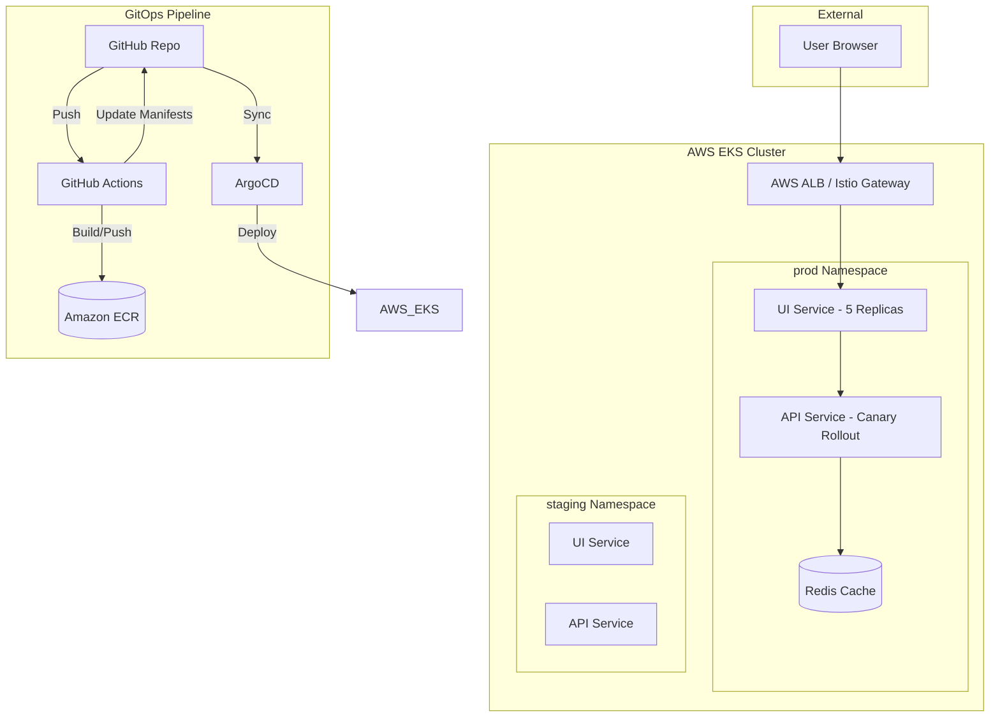

# Shorthub: Zero-Touch GitOps Platform (2026 Edition)

Shorthub is a production-grade URL shortening platform demonstrating state-of-the-art DevOps practices. It features a fully automated CI/CD pipeline, canary deployments, and multi-environment orchestration on AWS EKS.

## 🚀 Architecture Diagram

## 🛠️ Tech Stack
- **Languages**: Node.js 20 (Backend), React 18 (Frontend)
- **Frameworks**: Express, Vite, Tailwind CSS
- **Infrastructure**: Terraform, AWS EKS, VPC, IAM (IRSA)
- **GitOps**: ArgoCD, Argo Rollouts, Kustomize
- **Observability**: Prometheus, Grafana, Loki
- **Service Mesh**: Istio (Traffic Shifting)

## 📦 Features
- **Zero-Touch Deployment**: Push to `main` triggers image build, ECR push, and K8s manifest update.
- **Canary Strategy**: 20% traffic shift to new API versions with automated health checks.
- **Multi-Env Promotion**: Environment-specific overlays (Dev/Staging/Prod) managed via ApplicationSets.
- **Micro-Frontend Ready**: React UI served via Nginx with reverse proxy to backend.
- **High Availability**: Multi-AZ node groups with Spot instance cost optimization.

## 🚦 Getting Started (Local)
1. Clone the repo.
2. Run `docker-compose up`.
3. Open `http://localhost`.

## 🏗️ Deployment (AWS)
1. Initialize Terraform: `terraform init && terraform apply`.
2. Configure AWS Secrets in GitHub: `AWS_ACCESS_KEY_ID`, `AWS_SECRET_ACCESS_KEY`.
3. Push to `main` branch.
4. Access ArgoCD Dashboard: `kubectl get svc -n argocd`.

## 💼 Resume Bullets (Add to your profile!)
- **Architected a production-grade GitOps platform** using EKS, VPC, and ArgoCD, reducing deployment manual intervention by 100%.
- **Implemented advanced Canary deployment strategies** with Argo Rollouts and Istio, enabling 20% traffic shifting and automated rollbacks based on 5xx error rate thresholds.
- **Engineered a scalable multi-environment CI/CD pipeline** with GitHub Actions and Kustomize, achieving zero-downtime deployments across Dev, Staging, and Prod.
- **Automated Infrastructure as Code (IaC)** with Terraform modules for modular VPC and EKS cluster management, utilizing IAM Roles for Service Accounts (IRSA) for least-privilege security.
- **Enhanced system reliability** by integrating Prometheus and Grafana for real-time application monitoring and automated health-based rollouts.
